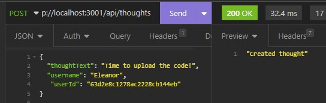

# Sadlers NoSQL Social Network API

## Description

Sadlers NoSQL Social Network API is a social network web application where users can share their thoughts, react to friends’ thoughts, and create a friend list.

## Access

The URL of the GitHub repository ...

https://github.com/lynnadelesadler/Sadlers-NoSQL-Social-Network-API

The URL of the walkthrough video  ...

https://drive.google.com/file/d/1JO6cbB2dACl3d2dF-HneWFjpjThOTEJM/view

## Installation
- Install node.js if not already installed on your machine
- Open the repo folder in Integrated Terminal. 
- Run the command `npm i` to install all node files.
- In the terminal run the command  `npm run seed`.
- once complete run the command `npm run dev` to connect to the database.

## Usage & Visuals

- WHEN I enter the command to invoke the application, THEN my server is started and the Mongoose models are synced to the MongoDB database.

- WHEN I open API GET routes in Insomnia for users and thoughts, THEN the data for each of these routes is displayed in a formatted JSON.

    - GET all users
    - 

    - GET a single user by its _id and populated thought and friend data
    - 

    - GET to get all thoughts
    - 

    - GET to get a single thought by its _id
    - 

- WHEN I test API POST, PUT, and DELETE routes in Insomnia, THEN I am able to successfully create, update, and delete users and thoughts in my database.
    - POST a new user:
    - 

    - PUT to update a user
    - 

    - DELETE to remove user 
    - 

    - POST to create a new thought 
    - 

    - PUT to update a thought 
    - 

    - DELETE to remove a thought
    - 

- WHEN I test API POST and DELETE routes in Insomnia, THEN I am able to successfully create and delete reactions to thoughts and add and remove friends to a user’s friend list.

    - POST to create a reaction 
    - 

    - DELETE to pull and remove a reaction
    - 

    - POST to add a new friend to a user's friend list
    - 

    - DELETE to remove a friend from a user's friend list
    - 

## Support
For help with this webpage please contact
|Name | Email |
|-----------|---------------------------|
|Lynn Sadler| lynnadelesadler@yahoo.com |

## Roadmap
Check back to this page as enhancements could be made for usability and optimized display. 

## Authors and acknowledgment
Acknowledgment to Node.js, MongoDB database, and the Mongoose ODM. and Express.js as this application runs off these applications.  

Coding credit to be given to Lynn Sadler.

Acknowledgement to Uconn Full Stack Web Developer Bootcamp, Teachers and Teacher assistants for supporting me on my developer journey!

## License
N/A

